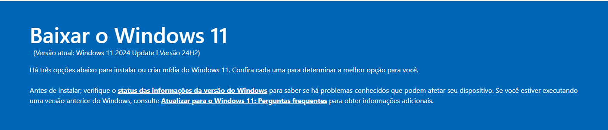
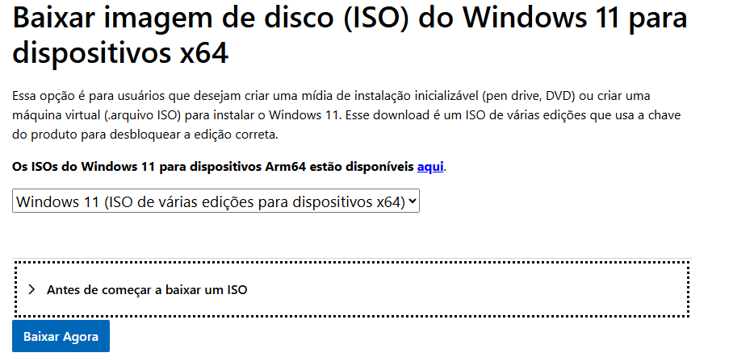
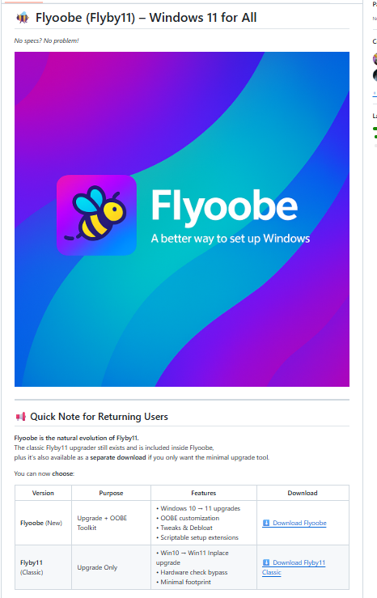

# 🖥️ Instalador Windows 11 com Flyoobe

Script em Python com interface gráfica para facilitar a instalação do Windows 11 em dispositivos não compatíveis, utilizando a ferramenta Flyoobe.

---

## 📦 Sobre o Projeto

Este projeto foi criado por **Marcos de Indaiatuba/SP** para ajudar usuários a instalar o Windows 11 de forma simples e visual, mesmo em máquinas que não atendem aos requisitos oficiais da Microsoft, como **TPM 2.0** ou **Secure Boot**.

---

## 🧭 Tutorial de Instalação do Windows 11 com Flyoobe

Este guia mostra passo a passo como usar o script Python e a ferramenta Flyoobe para instalar o Windows 11 em qualquer PC.

### 🔹 Etapa 1: Baixar a ISO do Windows 11

Acesse o site oficial da Microsoft:

🔗 [Download oficial da ISO do Windows 11](https://www.microsoft.com/pt-br/software-download/windows11)

- Na página, selecione a opção **"Baixar imagem ISO"**.
- Em seguida, confirme o idioma, como **Português - Brasil**.
- Por fim, baixe a versão **64 bits (x64)**.




### 🔹 Etapa 2: Baixar o Flyoobe

Acesse o repositório oficial:

🔗 [Repositório Flyoobe no GitHub](https://github.com/builtbybel/Flyoobe)


- Baixe o executável mais recente.
- O Flyoobe permite instalar o Windows 11 ignorando requisitos como TPM e Secure Boot.

### 🔹 Etapa 3: Executar o Script Python

No repositório, localize o arquivo `instalador_gui.py`. Para executá-lo:

1. Certifique-se de que o Python está instalado em seu sistema.
2. Execute o script com um clique duplo ou via terminal:
   ```bash
   python instalador_gui.py
A interface gráfica será exibida com os links organizados à esquerda da tela.

###🔹 Etapa 4: Usar o Flyoobe

Execute o Flyoobe como administrador e siga os passos:

Escolha entre uma instalação limpa ou uma atualização.

Personalize a instalação como desejar.

Para manter seus arquivos, configurações e aplicativos, selecione a opção de manter o perfil do Windows 10.

📌 Observações Importantes
Faça um backup de todos os seus arquivos antes de iniciar.

Você precisa ter uma chave válida do Windows para a ativação.

O Flyoobe ignora requisitos de hardware como TPM e Secure Boot.

📁 Estrutura do Repositório
instalador-win11-flyoobe/
├── assets/                  # Imagens usadas no tutorial
│   ├── Flyoobe.png
│   ├── ISO_WIN11.png
│   └── WIN11.png
├── instalador_gui.py        # Script principal com interface gráfica
└── README.md                # Este arquivo

👨‍💻 Autor
Marcos – Indaiatuba/SP

Este projeto foi criado para facilitar a instalação do Windows 11 em qualquer PC.
